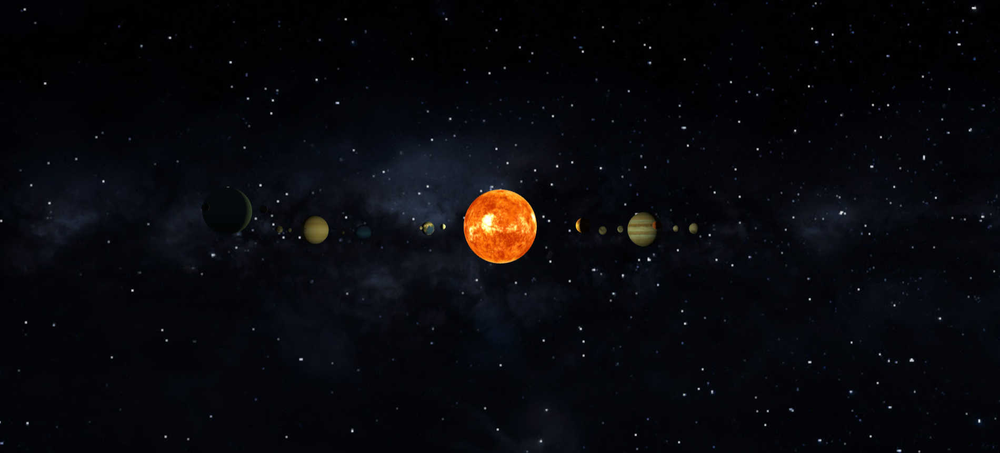

# 🌍 Solar System (Three.js)

Interactive 3D Solar System built with **Three.js** and **Vite**, featuring realistic planetary motion, texture mapping, and modular architecture.

---

## 🚀 Live Demo

👉 https://atta3554.github.io/solar-system/

---

## 📸 Preview



---

## ✨ Features

- 🌌 Real-time 3D solar system simulation
- 🪐 Planet rotation and orbital movement
- 🌑 Realistic textures (NASA-style assets)
- 🎥 Smooth camera controls (zoom / orbit / pan)
- ⏳ Loading system with preloader UI
- 🧩 Modular architecture (separated managers)
- ⚡ Optimized asset loading system

---

## 🧠 Architecture Overview

This project is structured in a modular way for scalability:

- **PlanetManager** → Creates and animates planets and orbits
- **LightManager** → Handles scene lighting (sun, ambient, etc.)
- **TextureManager** → Loads and caches textures efficiently
- **InteractionManager** → Handles user input and camera controls
- **Env** → Scene/environment configuration

---

## 🛠️ Tech Stack

- Three.js
- Vite
- JavaScript (ES Modules)

---

## 📦 Installation

Clone the repo:

```bash
git clone https://github.com/atta3554/solar-system.git
```

Install dependencies:

```bash
npm install
```

Run development server:

```bash
npm run dev
```

Build for production:

```bash
npm run build
```

---

## ⚙️ Deployment

This project is deployed using **GitHub Pages**.

Make sure Vite base path is set:

```js
base: "/solar-system/";
```

Then deploy `dist` contents to `gh-pages` branch.

---

## 📁 Project Structure

```
src/
├── core/
├── planet/
├── light/
├── interaction/
├── utils/
├── App.js
```

---

## 📌 Notes

- Textures must be loaded using correct base path (`import.meta.env.BASE_URL`)
- GitHub Pages requires correct asset paths
- Project is optimized for browser-based rendering (no backend)

---

## 🧪 Possible Improvements

- Add galaxy background / skybox enhancement
- Add planet info UI panel
- Add time-speed control
- Add labels for planets
- Improve loading screen transitions

---

## 📄 License

MIT License (optional section if you want)

---

## 🌟 Live Project

👉 [https://atta3554.github.io/solar-system/](https://atta3554.github.io/solar-system/)
